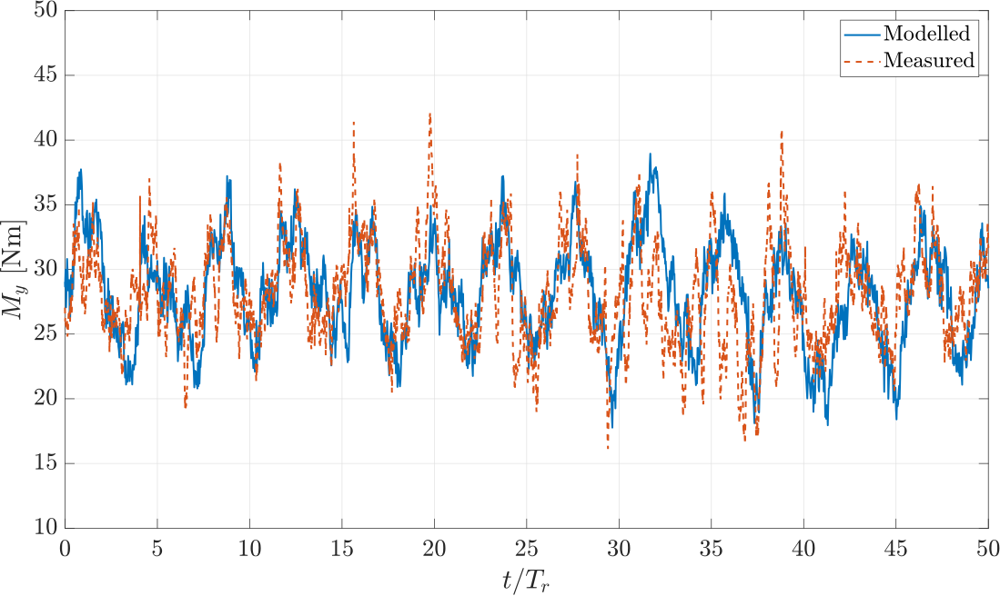
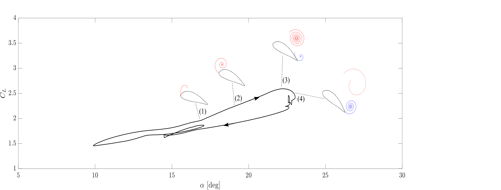
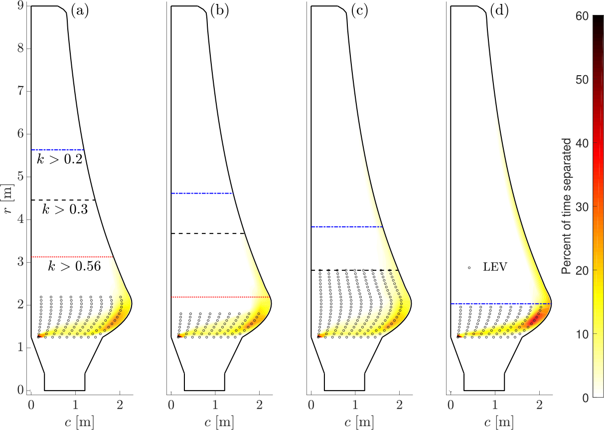

# transTide: Tidal Turbine Unsteady Load Model

**transTide** is a low-order numerical model developed to investigate how unsteady flow: including waves, turbulence, and shear—leads to load and power fluctuations on tidal turbine blades. 

🌟 **A First in Tidal Energy Research:** This project represents the **first work to utilize measured ADCP (Acoustic Doppler Current Profiler) data as a direct spanwise input** for quantifying unsteady hydrodynamics on full-scale rotors, setting it apart from standard BEM solvers.

## 🌊 Key Features
* **Coupled Physics:** Integrates Blade-Element Momentum (BEM) with attached flow, separated flow, and rotational augmentation.
* **Dynamic Stall Modeling:** Implementation of the Sheng et al. low-speed model to account for load hysteresis and leading-edge vortex shedding.
* **Spanwise Unsteadiness Quantification:** High-resolution mapping of separation and unsteadiness along the entire blade span.
* **Modern Object-Oriented Architecture:** Completely refactored in June 2021 for maximum modularity, performance, and readability.

---

## 📊 Model Highlights & Validation

*Note: The model has been rigorously benchmarked against tank-scale measurements and full-scale operational data.*

### 1. Root Bending Moment Validation
The model accurately predicts root bending moments during combined wave and turbulence loading, showing excellent agreement with measured tank-scale data.

*(Placeholder: Add Figure 7.4 from Thesis showing measured vs. predicted root bending moments)*

### 2. Leading-Edge Vortex Shedding
`transTide` captures the highly non-linear build-up and transit of the leading-edge vortex during dynamic stall.

*(Placeholder: Add Figure 9.13 from Thesis)*

### 3. Spanwise Separation Mapping
Contour mapping of unsteady hydrodynamics along the blade span during large wave conditions.

*(Placeholder: Add Figure 8.22 from Thesis)*

---

## 💻 Technical Requirements
* **Environment:** MATLAB R2016b or later.
* **Dependencies:** Base MATLAB only (no additional toolboxes required).
* **Architecture:** Modular class-based design with strict naming conventions for classes, functions, and scripts. Easy to extend for new inflow conditions or blade geometries.

---

## 🎓 Academic Context & Acknowledgements

This codebase was developed by **Dr. Gabriel Thomas Scarlett** in support of his PhD at **The University of Edinburgh** (2015–2018), under the supervision of **Dr. Ignazio Maria Viola**. 

The work was conducted in the context of the **ReDAPT (Reliable Data Acquisition Platform for Tidal)** project, and the methods developed here continue to be utilized by researchers analyzing unsteady tidal hydrodynamics.

### Publications
If you use `transTide` in your research, please consider citing the foundational thesis or relevant journal papers:

**Primary Thesis:**
* Scarlett, G. T. (2018). *Unsteady Hydrodynamics of Tidal Turbine Blades*. The University of Edinburgh. [Available here (Edinburgh Research Archive)](https://era.ed.ac.uk/items/e9f86e9f-7dff-4d6a-b45a-11378efde862)

**Journal Papers:**
1. Scarlett, G.T., et al. (2019). "Unsteady hydrodynamics of a full-scale tidal turbine operating in large wave conditions," *Renewable Energy*. [DOI: https://doi.org/10.1016/j.renene.2019.06.153]
2. Scarlett, G. T., & Viola, I. M. (2020). Unsteady hydrodynamics of tidal turbine blades," *Renewable Energy*. [DOI: https://doi.org/10.1016/j.renene.2019.06.153]

---

## 📜 License
Copyright © 2021 Gabriel Thomas Scarlett. 

This project is open-source and licensed under the MIT License. See the `LICENSE` file for details.
